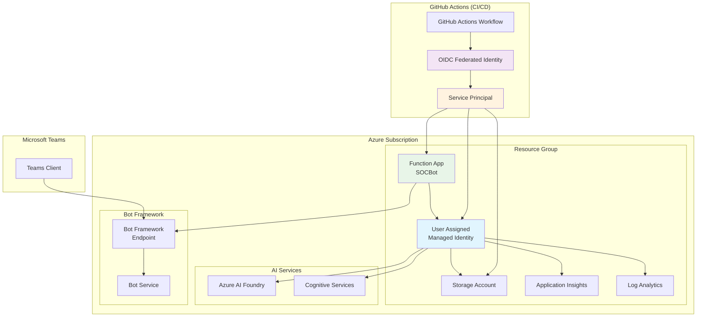

# SOCBot Security Architecture

This document outlines the comprehensive security architecture for SOCBot, focusing on User Assigned Managed Identity, zero-trust principles, and minimum privilege access patterns.

## 🛡️ Security Architecture Overview



## 🔐 Identity and Access Management

### User Assigned Managed Identity (UAMI)

**Primary Identity**: `socbot-{environment}-identity`

**Key Benefits**:
- No credentials stored in application code
- Automatic token lifecycle management
- Azure AD integration and logging
- Granular RBAC control per resource

**Authentication Flow**:
1. Function App requests token using UAMI
2. Azure Instance Metadata Service validates identity
3. Azure AD issues access token scoped to specific resource
4. Token used for API authentication (Storage, AI, Monitoring)

### Role-Based Access Control (RBAC)

#### Storage Account Permissions
```json
{
  "roles": [
    {
      "name": "Storage Blob Data Contributor",
      "id": "ba92f5b4-2d11-453d-a403-e96b0029c9fe",
      "scope": "Storage Account",
      "purpose": "Function app deployment package access",
      "permissions": ["read", "write", "delete blobs"]
    },
    {
      "name": "Storage Account Contributor", 
      "id": "17d1049b-9a84-46fb-8f53-869881c3d3ab",
      "scope": "Storage Account",
      "purpose": "WebJobs storage operations",
      "permissions": ["manage storage account properties"]
    }
  ]
}
```

#### AI and Cognitive Services Permissions
```json
{
  "roles": [
    {
      "name": "Cognitive Services User",
      "id": "a97b65f3-24c7-4388-baec-2e87135dc908", 
      "scope": "Resource Group",
      "purpose": "AI agent API calls",
      "permissions": ["call cognitive services APIs"]
    },
    {
      "name": "Azure AI Developer",
      "id": "64702f94-c441-49e6-a78b-ef80e0188fee",
      "scope": "Resource Group", 
      "purpose": "AI Foundry operations",
      "permissions": ["manage AI projects and models"]
    }
  ]
}
```

#### Monitoring and Logging Permissions
```json
{
  "roles": [
    {
      "name": "Monitoring Metrics Publisher",
      "id": "3913510d-42f4-4e42-8a64-420c390055eb",
      "scope": "Application Insights",
      "purpose": "Publish telemetry data", 
      "permissions": ["write metrics and telemetry"]
    },
    {
      "name": "Log Analytics Contributor",
      "id": "92aaf0da-9dab-42b6-94a3-d43ce8d16293",
      "scope": "Log Analytics Workspace",
      "purpose": "Query and manage logs",
      "permissions": ["read/write log data"]
    }
  ]
}
```

## 🔒 GitHub Actions Security

### OpenID Connect (OIDC) Federation

**No Stored Secrets**: Uses federated identity credentials instead of long-lived secrets.

**Federated Identity Configuration**:
```json
{
  "name": "socbot-main-branch",
  "issuer": "https://token.actions.githubusercontent.com",
  "subject": "repo:hyperfox22/socbot:ref:refs/heads/main",
  "audiences": ["api://AzureADTokenExchange"]
}
```

**Security Benefits**:
- Short-lived tokens (1 hour maximum)
- Automatic token rotation
- Branch and repository-specific access
- No credential leakage risk
- Azure AD audit trail

### Service Principal Permissions

**Deployment Service Principal**: Minimum required permissions for infrastructure deployment.

```json
{
  "subscriptionRoles": [],
  "resourceGroupRoles": [
    {
      "role": "Contributor",
      "purpose": "Create and manage Azure resources"
    },
    {
      "role": "User Access Administrator", 
      "purpose": "Assign RBAC roles during deployment"
    }
  ]
}
```

**Scope Limitation**: Permissions scoped to specific resource groups only.

## 🌐 Network Security

### Function App Security

**HTTPS Enforcement**:
```json
{
  "httpsOnly": true,
  "tlsVersion": "1.2",
  "allowInsecureConnections": false
}
```

**CORS Configuration**:
```json
{
  "allowedOrigins": ["https://teams.microsoft.com"],
  "supportCredentials": false,
  "maxAge": 86400
}
```

**Private Networking (Optional)**:
- Virtual Network integration
- Private endpoints for storage
- Service endpoints for AI services

### Storage Security

**Security Configuration**:
```json
{
  "properties": {
    "supportsHttpsTrafficOnly": true,
    "allowBlobPublicAccess": false,
    "defaultToOAuthAuthentication": true,
    "minimumTlsVersion": "TLS1_2",
    "allowSharedKeyAccess": false
  }
}
```

**Network Access Control**:
```json
{
  "networkAcls": {
    "bypass": "AzureServices",
    "defaultAction": "Allow"
  }
}
```

## 🔍 Monitoring and Auditing

### Security Monitoring

**Azure Monitor Integration**:
- Authentication failures
- RBAC role assignment changes  
- Unusual access patterns
- Token usage analytics

**Application Insights Security Metrics**:
- Request authentication status
- Failed authentication attempts
- Suspicious user behavior
- API rate limiting violations

**Log Analytics Queries**:
```kql
// Monitor managed identity token requests
AzureActivity
| where Authorization contains "Microsoft.ManagedIdentity"
| where ActivityStatus == "Failure"
| project TimeGenerated, Caller, Authorization, ActivityStatus

// Monitor RBAC changes
AzureActivity  
| where OperationName contains "roleAssignments"
| project TimeGenerated, Caller, OperationName, Properties
```

### Compliance and Auditing

**Audit Trail Components**:
1. **GitHub Actions Logs**: All deployment activities
2. **Azure Activity Logs**: Resource management operations  
3. **Azure AD Audit Logs**: Identity and access events
4. **Application Insights**: Runtime security events
5. **Function App Logs**: Bot interactions and errors

**Retention Policies**:
- Activity Logs: 90 days
- Application Insights: 365 days  
- Log Analytics: 30 days (configurable)
- GitHub Actions: Per repository settings

## ⚡ Runtime Security

### Bot Framework Security

**Authentication**:
```typescript
// Bot Framework JWT validation
const adapter = new BotFrameworkAdapter({
    appId: process.env.MicrosoftAppId,
    appPassword: process.env.MicrosoftAppPassword,
    channelAuthTenant: process.env.M365TenantId
});
```

**Input Validation**:
- Message content sanitization
- Command parameter validation
- Rate limiting per user/conversation
- Malicious content detection

### AI Integration Security

**Secure AI Agent Communication**:
```typescript
// Managed Identity authentication
const credential = new ManagedIdentityCredential({
    clientId: process.env.clientId
});

const client = new AIProjectClient(connectionString, credential);
```

**Data Protection**:
- PII detection and masking
- Conversation history encryption
- Secure prompt injection prevention
- Output content filtering

### Environment Variable Security

**Secure Configuration**:
```json
{
  "secureSettings": [
    "PROJECT_CONNECTION_STRING",
    "MicrosoftAppPassword", 
    "M365_CLIENT_SECRET"
  ],
  "managedIdentitySettings": [
    "clientId",
    "AZURE_CLIENT_ID"
  ],
  "publicSettings": [
    "AGENT_ID",
    "MicrosoftAppId",
    "M365_TENANT_ID"
  ]
}
```

## 🚨 Incident Response

### Security Incident Classification

**High Severity**:
- Unauthorized access to AI agents
- Bot Framework compromise
- Data exfiltration attempts
- Managed identity token abuse

**Medium Severity**:
- Authentication failures spike
- Unusual API usage patterns
- Configuration drift
- Failed deployments

**Low Severity**:
- Performance degradation
- Non-security errors
- Monitoring gaps

### Response Procedures

**Immediate Response** (< 15 minutes):
1. Disable affected managed identity
2. Revoke active tokens via Azure AD
3. Scale down Function App (if necessary)
4. Enable additional logging

**Investigation** (< 2 hours):
1. Review Azure Activity Logs
2. Analyze Application Insights data
3. Check GitHub Actions history
4. Validate RBAC assignments

**Recovery** (< 4 hours):
1. Deploy known-good configuration
2. Rotate credentials (if applicable)
3. Update security rules
4. Restore normal operations

### Contact Information

**Security Team**: security@organization.com
**On-Call Engineer**: Available 24/7 via PagerDuty
**Azure Support**: Premium support ticket
**Microsoft Teams Support**: Teams admin center

## 📋 Security Checklist

### Pre-Deployment
- [ ] Service principal configured with minimum permissions
- [ ] OIDC federated credentials properly scoped
- [ ] All secrets stored securely (Azure Key Vault or GitHub Secrets)
- [ ] Bicep templates validated for security compliance
- [ ] Network security rules configured

### Post-Deployment  
- [ ] Managed identity roles verified
- [ ] Function App security settings confirmed
- [ ] Bot Framework authentication tested
- [ ] AI agent connectivity validated
- [ ] Monitoring alerts configured
- [ ] Security dashboard operational

### Ongoing Maintenance
- [ ] Monthly RBAC permission review
- [ ] Quarterly security assessment
- [ ] Regular dependency updates
- [ ] Incident response plan testing
- [ ] Compliance audit preparation

## 📚 Security References

- [Azure Managed Identity Best Practices](https://docs.microsoft.com/azure/active-directory/managed-identities-azure-resources/managed-identities-best-practice-recommendations)
- [GitHub Actions OIDC Security](https://docs.github.com/actions/deployment/security-hardening-your-deployments/about-security-hardening-with-openid-connect)
- [Azure Functions Security](https://docs.microsoft.com/azure/azure-functions/security-concepts)
- [Bot Framework Security](https://docs.microsoft.com/azure/bot-service/bot-builder-security-guidelines)
- [Azure AI Security](https://docs.microsoft.com/azure/ai-services/security)

---

**Document Version**: 1.0  
**Last Updated**: September 2025  
**Classification**: Internal Use  
**Owner**: Security Architecture Team

*This security architecture follows Microsoft's Zero Trust principles and industry best practices for cloud-native applications.*